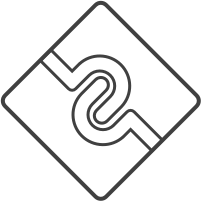

<p align="center">
  
</p>

<p align="center">
  <a href="https://www.npmjs.com/package/@midwayjs/hooks">
    
  </a>
  
  <a href="https://codecov.io/gh/midwayjs/hooks">
    
  </a>
  
</p>

# 更快的全栈框架

Docs：[Getting Started - 新云端一体解决方案](https://www.yuque.com/midwayjs/faas/quickstart_integration)

## ✨ 特性

- ☁️&nbsp;&nbsp;全栈，在 src 一个目录中开发前后端代码
- 🌈&nbsp;&nbsp;最简单的后端 Api 开发与调用方式
- 🌍 使用 "React Hooks" 开发后端
- 📦 跨前端框架. 支持 React / Vue3 / ICE.js
- ⚙️ 基于 [Midway](https://github.com/midwayjs/midway), 提供 Web 及 Serverless 场景下的完整支持.
- 🛡 完善的 TypeScript 支持

## Demo

### 从后端导入代码并调用

> backend api

```typescript
export async function get() {
  return 'Hello Midway Hooks'
}

export async function post(name: string) {
  return 'Hello ' + name
}
```

> frontend

```typescript
import { get, post } from './apis/lambda'

/**
 * @method GET
 * @url /api/get
 */
get().then((message) => {
  // Display: Hello Midway Hooks
  console.log(message)
})

/**
 * @method POST
 * @url /api/post
 * @body { args: ['github'] }
 */
post('github').then((message) => {
  // Display: Hello github
  console.log(message)
})
```

### Hooks

> backend api

```typescript
import { useContext } from '@midwayjs/hooks'

export async function getPath() {
  const ctx = useContext()
  return ctx.path
}
```

> frontend

```typescript
import { getPath } from './apis/lambda'

/**
 * @method GET
 * @url /api/getPath
 */
getPath().then((path) => {
  // Display: /api/getPath
  console.log(path)
})
```

## Contribute

我们使用 yarn + lerna 管理项目

> install dependencies

```bash
$ yarn
```

> build

```bash
$ yarn build
```

> watch

```bash
$ yarn watch
```

> test

```bash
$ yarn test
```
